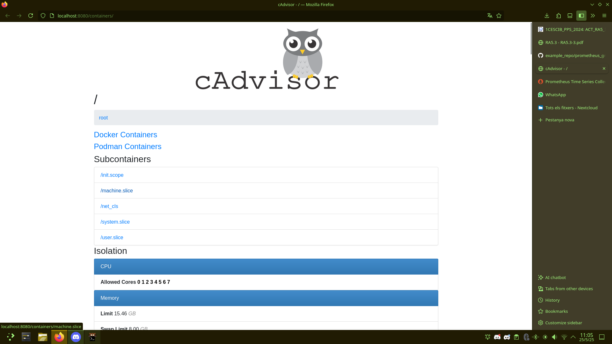
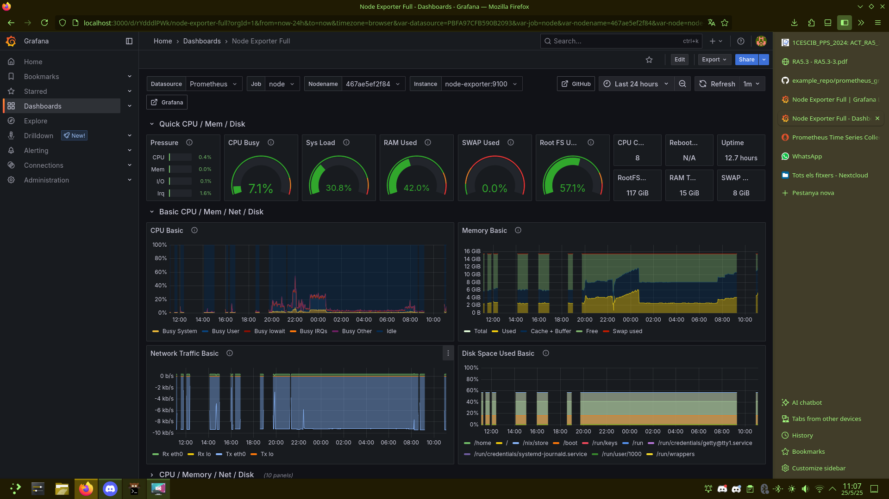
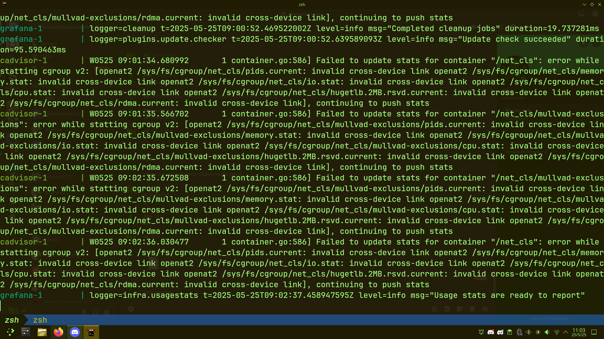
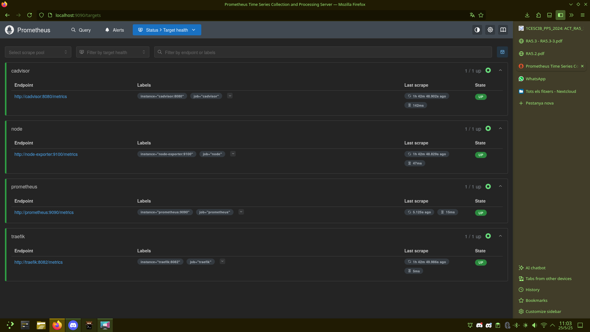

# 🖥️ Sistema de Monitorización con Prometheus, Grafana y cAdvisor

## 🧩 Descripción del proyecto

Este ejercicio tiene como objetivo la instalación y validación de un sistema de monitorización en un entorno Ubuntu, compuesto por Prometheus, Grafana, Node Exporter y cAdvisor. Se han recopilado métricas clave de CPU, RAM, disco, red y contenedores, y se han visualizado en tiempo real a través de paneles gráficos personalizados.

---

## 📦 Componentes del Stack

| Componente    | Descripción                                                                 |
|---------------|-----------------------------------------------------------------------------|
| **Prometheus** | Recolector de métricas basado en series temporales                         |
| **Node Exporter** | Exportador de métricas básicas del sistema (CPU, disco, red, etc.)         |
| **Grafana**     | Plataforma de visualización de datos y generación de dashboards            |
| **cAdvisor**    | Herramienta para la monitorización de contenedores Docker y recursos CGroup |

---

## 🔧 Infraestructura usada

- 🖥️ **Servidor**: Ubuntu Server con Prometheus + Node Exporter
- 🖥️ **Cliente**: Ubuntu Desktop 24.10 con Grafana + configuración del dashboard
- 📡 Conexión remota del cliente al servidor para ingesta de métricas

---

## 📸 Capturas de Evidencia

### 📊 cAdvisor (http://localhost:8080)
Monitoreo de contenedores y CGroups:

---

### 📈 Dashboard de Grafana
Visualización completa de métricas de CPU, RAM, red y disco:

---

### 🧪 Logs de Prometheus y cAdvisor
Evidencia de funcionamiento y errores de tipo `invalid cross-device link`, típicos al usar `openat2` con cgroups v2:

---

### 🎯 Estado de los targets en Prometheus (http://localhost:9090/targets)
Verificación de que todos los endpoints están siendo recolectados correctamente:

---

## ✅ Conclusión

El sistema de monitorización se ha desplegado correctamente, cumpliendo los objetivos de la actividad 3.1:

- 🚀 Stack desplegado y operativo
- 📥 Métricas recolectadas desde el servidor
- 📊 Visualización gráfica desde cliente con Grafana
- 📌 Validación de endpoints y funcionamiento con logs

Este entorno proporciona una base sólida para la detección de incidentes y análisis de rendimiento, contribuyendo al aprendizaje del resultado **RA5**: _"Analiza incidentes de ciberseguridad utilizando herramientas, mecanismos de detección y alertas de seguridad"_:contentReference[oaicite:0]{index=0}.

---

## 📚 Referencias

- 🔗 [Prometheus](https://prometheus.io/)
- 📊 [Grafana](https://grafana.com/)
- 📦 [Node Exporter](https://github.com/prometheus/node_exporter)

---

