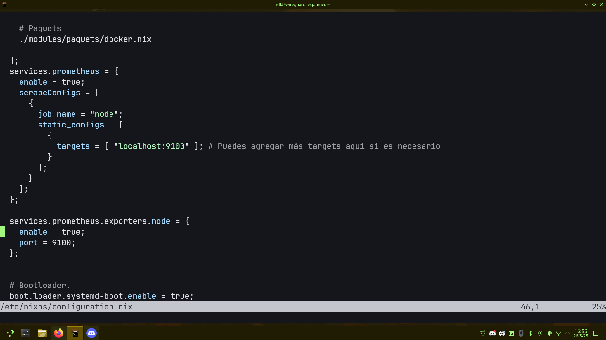
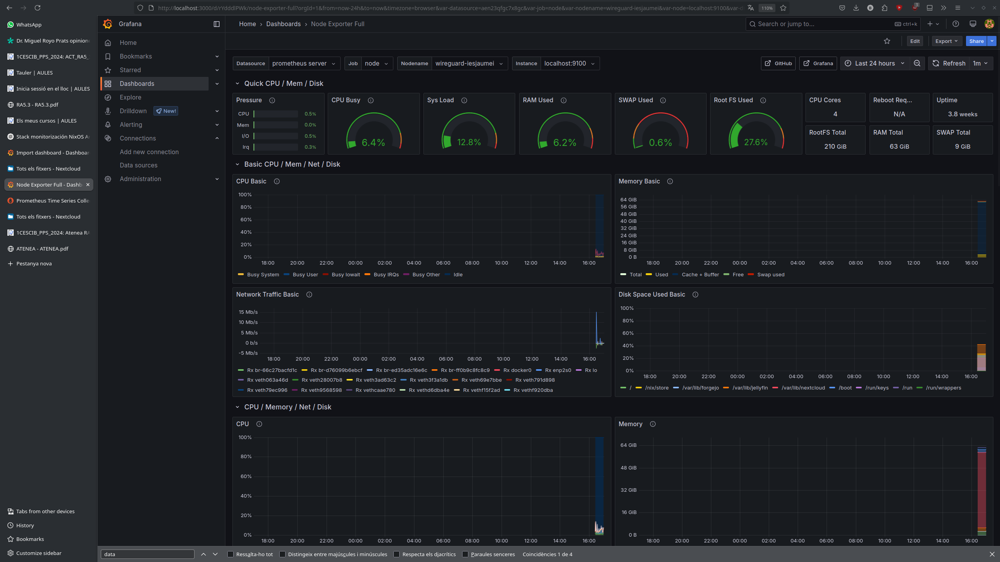
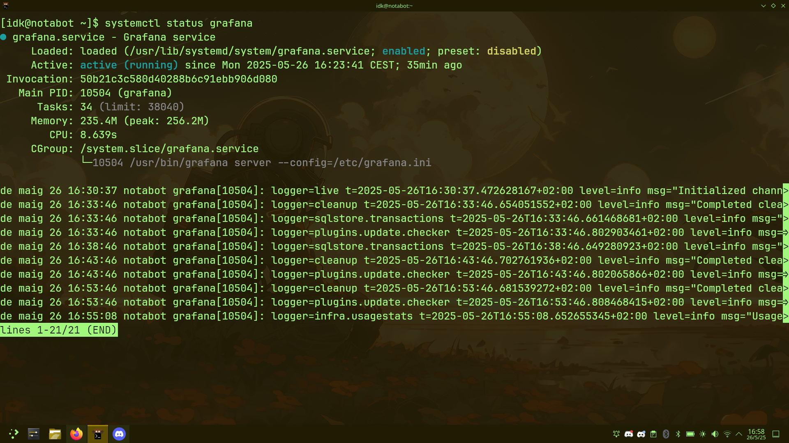

# 🖥️ Sistema de Monitorización Personalizado con NixOS y Arch Linux

## 🧩 Descripción del proyecto

Este ejercicio demuestra la implementación de un stack de monitorización utilizando **Prometheus**, **Grafana** y **Node Exporter**, con una infraestructura personalizada. A diferencia del primer ejercicio, se ha usado un servidor propio con **NixOS** para desplegar Prometheus y Node Exporter, y un cliente con **Arch Linux** para instalar Grafana y visualizar los datos de forma gráfica.

---

## 📦 Componentes del Stack

| Componente     | Descripción                                                                 |
|----------------|-----------------------------------------------------------------------------|
| **Prometheus** | Recolector de métricas basado en series temporales                         |
| **Node Exporter** | Exportador de métricas básicas del sistema (CPU, disco, red, etc.)         |
| **Grafana**    | Plataforma de visualización de datos y generación de dashboards            |

---

## 🔧 Infraestructura usada

- 🖥️ **Servidor**: NixOS con Prometheus + Node Exporter habilitados vía configuración declarativa (`configuration.nix`)
- 🖥️ **Cliente**: Arch Linux con Grafana instalado y corriendo como servicio systemd
- 📡 Comunicación local entre Prometheus y Node Exporter (localhost:9100) y visualización desde Grafana en el mismo entorno

---

## 📸 Capturas de Evidencia

### ⚙️ Configuración de Prometheus en NixOS
Definida en `/etc/nixos/configuration.nix`, muestra cómo se exponen los targets y se habilita el exporter:

---

### 📈 Dashboard de Grafana
Visualización avanzada del dashboard "Node Exporter Full" con métricas detalladas del sistema:

---

### 🧪 Logs del Servicio Grafana
Estado y registros del servicio `grafana.service` ejecutándose correctamente en Arch Linux:

---

## ✅ Conclusión

Este ejercicio ha validado la implementación de un stack de monitorización totalmente funcional, utilizando distintas distribuciones Linux de forma colaborativa:

- 🛠️ Prometheus configurado de forma declarativa en NixOS
- 📥 Node Exporter exponiendo métricas en localhost:9100
- 📊 Grafana operando desde Arch Linux con dashboards configurados
- 🔗 Comunicación local verificada y logs de servicios en funcionamiento

Este despliegue demuestra la flexibilidad de herramientas modernas de observabilidad y cómo se adaptan a infraestructuras reales, cumpliendo con el resultado de aprendizaje **RA5**: _"Analiza incidentes de ciberseguridad utilizando herramientas, mecanismos de detección y alertas de seguridad"_:contentReference[oaicite:0]{index=0}.

---

## 📚 Referencias

- 🔗 [Prometheus](https://prometheus.io/)
- 📊 [Grafana](https://grafana.com/)
- 📦 [Node Exporter](https://github.com/prometheus/node_exporter)

